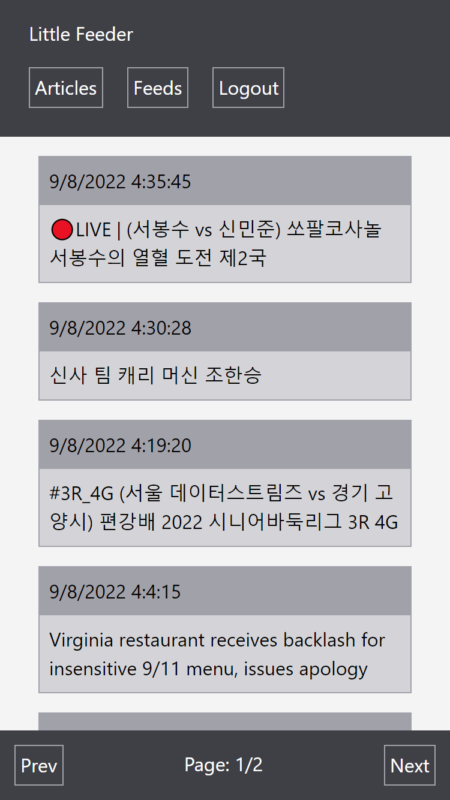

# Little-Feeder

## Table of Contents

1. [Description](#Description)
1. [Technologies Used](#Technologies)
1. [Installation](#Installation)
1. [Deployed Instance](#Deployed)
1. [Questions](#Questions)

## Description

A barebones rss/atom feed reader. Allows you to add rss/atom feeds to track and lets you view the articles.


## Technologies Used

- [express-validator](https://github.com/express-validator/express-validator)
  for server-side input validation
- [feed-reader](https://github.com/ndaidong/feed-reader)
  for retreiving rss/atom feeds
- [sequelize](https://sequelize.org/) ORM
- [mysql](https://www.mysql.com/) database
- [express](https://expressjs.com/) web framework
- [handlebars](https://handlebarsjs.com/) templating
- [tailwindcss](https://tailwindcss.com/) css framework
- [bcrypt](https://github.com/kelektiv/node.bcrypt.js) password hashing
- [express-session](https://github.com/expressjs/session) [connect-session-sequelize](https://github.com/mweibel/connect-session-sequelize) authentication

## Installation

installation:
git clone the repo and install the dependencies with
`npm install`
setup a .env file with the following env vars:

```
DB_NAME='little_feeder_db'
DB_USER='<your user>'
DB_PASS='<your password>'
SSECRET='<your session secret>'
SCHEDWK='<window to grab feeds in seconds>'
```

setup the db and seed it with the following command:
`npm run scrub`

start the web server with:
`npm start`

## Deployed Instance

This [link](https://blooming-ocean-86846.herokuapp.com/) will take you to a deployed instance of the app.

## Questions

- [Amon1459](https://github.com/Amon1459)
- [chodge9](https://github.com/chodge9)
- [ettad](https://github.com/ettad)
- [rrrbbbsss](https://github.com/rrrbbbsss)
